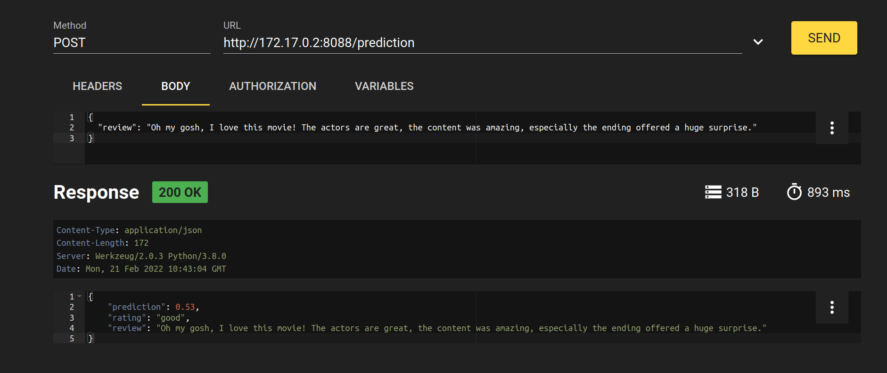

# Tensorflow

This repository serves of a playground to work with Neural Networks based on the
[TensorFlow](https://www.tensorflow.org/) and [Keras](https://keras.io/about/) package.
Basically, we develop a Neural Network to predict the movie rating based on a review 
([dataset from IMDB](https://keras.io/datasets/#imdb-movie-reviews-sentiment-classification)).

Implementation of the model is based on this [kaggle tutorial](https://www.kaggle.com/divyansh22/imdb-beginner-sentiment-analysis).

# Testing
Run tests for prediction via: 

```
python3 -m pytest
```
# Rest API

We build a Docker image and run it to test the REST API:

```
docker build -t tensorflowapi:0.1.0 .
docker run tensorflowapi:0.1.0
```

In the shell, we receive a URL to which we can send our request: `<URL>/prediction`
Here an example request via RESTer:



