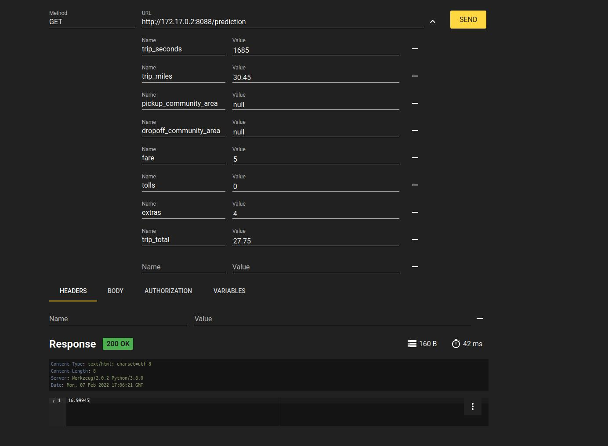

# XGBoost

This repository serves a playground with the [XGBoost](https://xgboost.readthedocs.io/en/stable/) package. The task is to predict
the tip of a taxi ride based on several columns, see [data](data/data.csv). 

We developed several functions executable via CLI as well as a REST API within a docker container.

We use Python 3.8

## Prediction

Predict data: 

```
python3 predict_value.py -ts 885 -tm 30.45 -f 12.75 -t 0 -e 4 -tt 16.75
```

You can find more information about the function's parameters via:

```
python3 predict_value.py -help
```

## Model (re)training

We can train a new model or retrain an existing one. Via
parameters, we have the following options:

1. Train a new model with standard parameters:

```
python3 main.py -f data/data.csv -lc 0
```

2. Train a new model with configured parameters:

```
python3 main.py -f data/data.csv -lc 0 -sp 0.1 -i 1000 -lr 0.8 -d 12
```

3. Train a new model with configured parameters and specified MSE (mean squared error):

```
python3 main.py -f data/data.csv -lc 0 -sp 0.1 -i 1000 -lr 0.8 -d 12 -mse 0.2
```

4. Retrain an existing model with configured parameters:

```
python3 main.py -f data/data.csv -lc 0 -sp 0.1 -i 3000 -lr 0.5 -d 8 -model model.json
```

## Testing

Run tests for prediction and REST API via: 

```
python3 -m pytest
```

## Rest API

We build a Docker image and run it to test the REST API:

```
docker build -t xgboostapi:0.1.0 .
docker run xgboostapi:0.1.0
```

In the shell, we receive a URL to which we can send our request: `<URL>/prediction`
Here an example request via RESTer:


